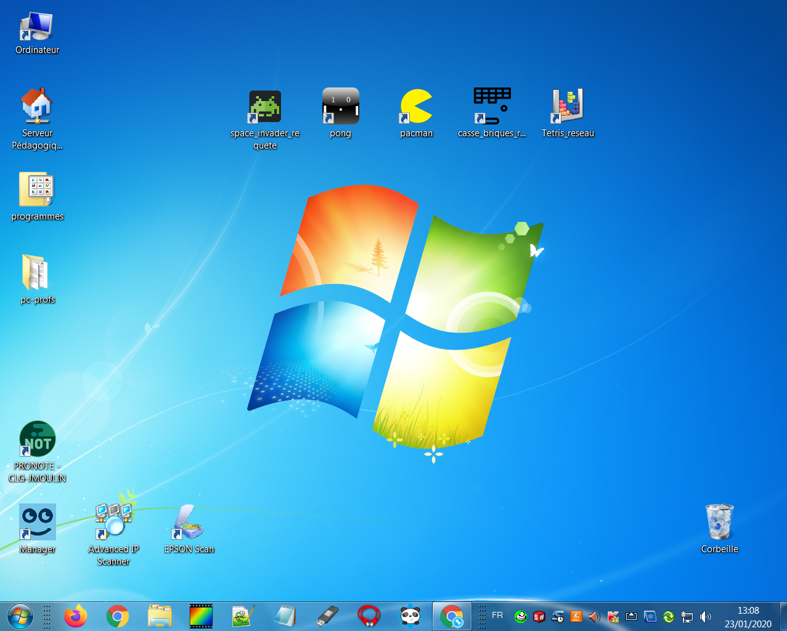

Les projets de retrogaming sont destinés aux élèves de collège ou autodidactes. Ces jeux ne peuvent fonctionner qu'à partir d'une application conçue avec appinvertor. Impossible d'utiliser le clavier ou la souris. L'idée est de concevoir une application pour les piloter à distance au moyen d'envoi de requetes HTTP.

